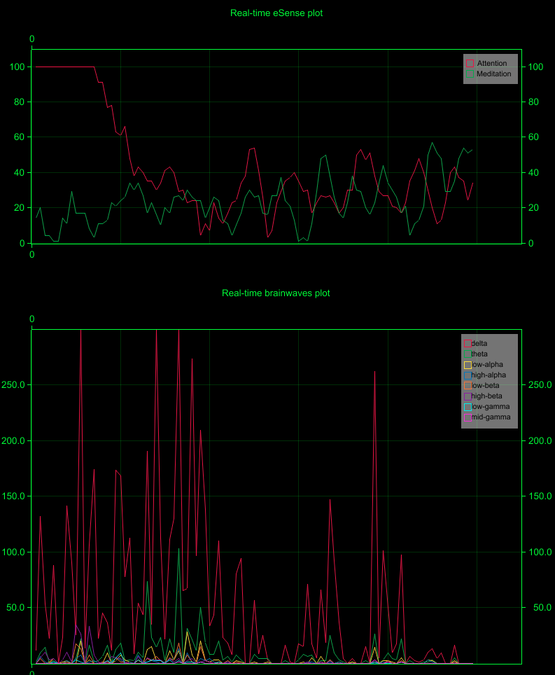

# rustymind

[](https://crates.io/crates/rustymind)
[](https://docs.rs/rustymind)

Rustymind is a driver and parser for NeuroSky MindWave EGG headset written in pure Rust. You can use it to connect, interact, and plot real time data from the headset.

The parser is based on the [mindwave mindset communication protocols](./docs) published by NeuroSky.

See below for a screenshot of real time mindwaves plotted by `rustymind-plot` CLI based on `rustymind` parser.



## Getting Started

`rustymind-plot` takes two arguments to run:

- MindWave device path. On Mac, the path would be in the format of `/dev/tty.usbserial-10000`
- Headset ID (printed inside the battery case)

```sh
cargo run --bin rustymind-plot "/dev/tty.usbserial-10000" a05f
```

If you don't pass in the headset ID argument, the dongle will auto-connect to any headsets it can find.

To use `rustymind` as a library, you need to use `connect_headset` function and `Parser` struct. For example:

```rust
use rustymind::{connect_headset, PacketType, Parser, HEADSETID_AUTOCONNECT};

let mut port = connect_headset("/dev/tty.usbserial-10000", b"\xa0\x5f")?;
let mut temp: Vec<u8> = vec![0; 2048];
let mut parser = Parser::new();

loop {
    let byte_buf = port.read(temp.as_mut_slice()).unwrap();
    for i in 0..byte_buf {
        if let Some(x) = parser.parse(temp[i]) {
            for r in x {
                match r {
                    PacketType::Attention(value) => {
                        println!("Attention value = {}", value);
                    }
                    PacketType::Meditation(value) => {
                        println!("Meditation value = {}", value);
                    }
                    PacketType::AsicEgg(value) => {
                        println!("EGG power values = {:?}", value);
                    }
                    _ => (),
                }
            }
        }
    }
}
```

This software is not intended to be used in medical diagnostics or medical
treatment.
